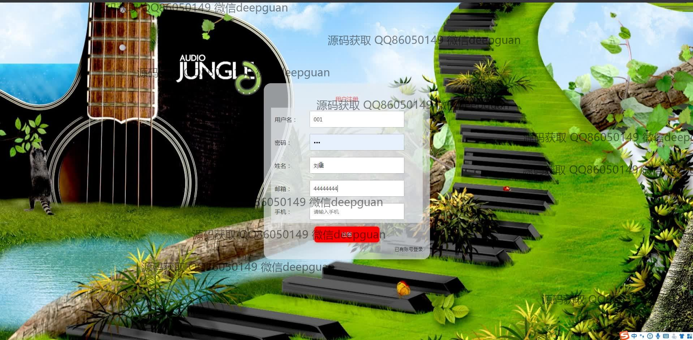
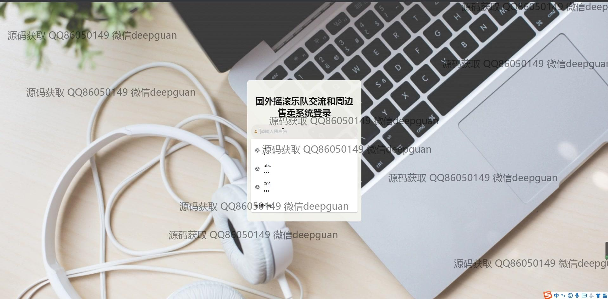
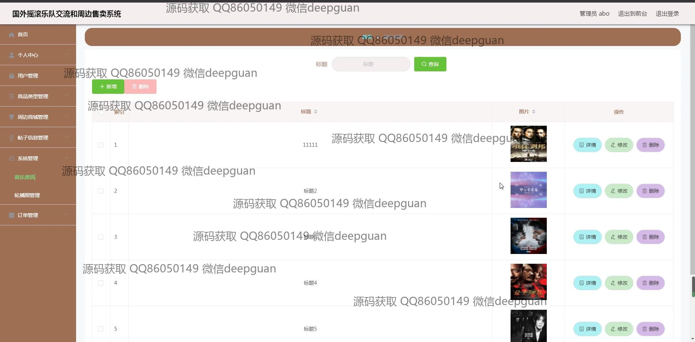

<h1 align="center">国外摇滚乐队交流和周边售卖系统+vue</h1>

## 简介
国外摇滚乐队交流和周边售卖系统：角色分为管理员、用户；支持用户管理、商品类型管理、订单管理、帖子信息管理、音乐资讯发布、商品浏览和购买、评论互动。    --计算机毕业设计源码；毕设源码；java毕业设计源码

## 联系方式

<h3 align="center">获取完整代码与数据库文件 + 微信：deepguan QQ: 86050149 QQ群: 783742310</h3>

<h3 align="center">可帮忙远程部署 包运行成功！提供远程部署、修改代码、设计文档指导、代码讲解等服务！</h3>

## 功能介绍（完整见运行截图）
管理员：管理员可以通过系统进行用户管理，包括注册、登录和退出账户。网站的后台管理提供商品类别管理、订单管理、用户信息管理和系统信息管理等功能。管理员还能编辑和发布音乐资讯及商品信息，支持上传图片和设置类型。导航栏包含个人中心、订单管理和商品类型管理模块，便于快速访问不同功能区域。管理员能够审核帖子信息、管理用户评论，以及调整和确认商品的库存、价格和上架日期等细节。

用户：用户登录系统后能够访问个人中心查看和修改个人信息，管理订单和收货地址。通过网站首页的主导航栏，用户可以浏览音乐资讯、商品列表，并通过搜索功能查找特定商品。商品模块支持详细查看周边商品的图片、描述、价格和库存，并允许用户加入购物车进行结算和在线支付。用户可以参与论坛交流，发布和回复帖子，与其他用户互动分享音乐体验，同时通过个人中心管理收藏夹中的内容和订单信息。

## 运行截图

本代码来源于网络,仅供学习参考使用!

